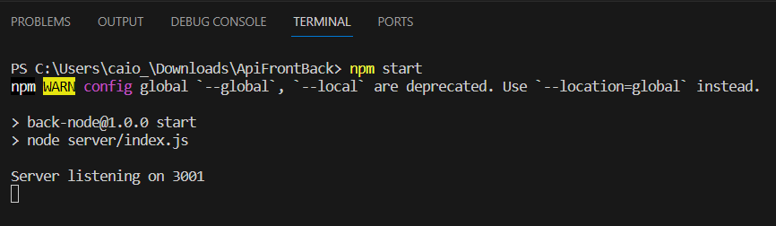

# Conteúdo criado para checkpoint de OPTIMIZATION-TECHNOLOGY(FrontEnd) + DIGITAL EXPERIENCE PLATAFORM(BackEnd)

### Backend

- Desenvolido em Node.js utilizando Express um framework web que facilita a criação de rotas e manipulação de requisições HTTP;
- No Diretorio Raiz utilizar o comando "npm start" para subir o Backend;
- /api é utilizado para o front consultar e expor no Browser estilizado.

### FrontEnd

- Link do repositório:
 - https://github.com/CaioZanardo/FrontEnd-CP6

## Grupo

- André Spinelli Cintra RM 551016
- Augusto de Oliveira Laurino RM 93498
- Caio Felipe Britto Zanardo da Silva RM 95125
- Gabriel Wilke Azevedo RM 95211
- Guilherme de Lucas Garcia RM 94392