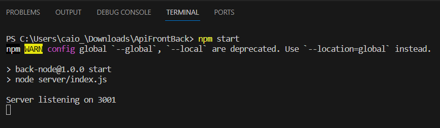
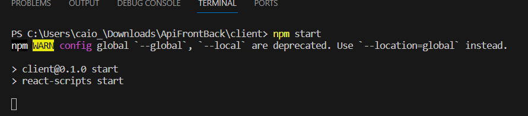
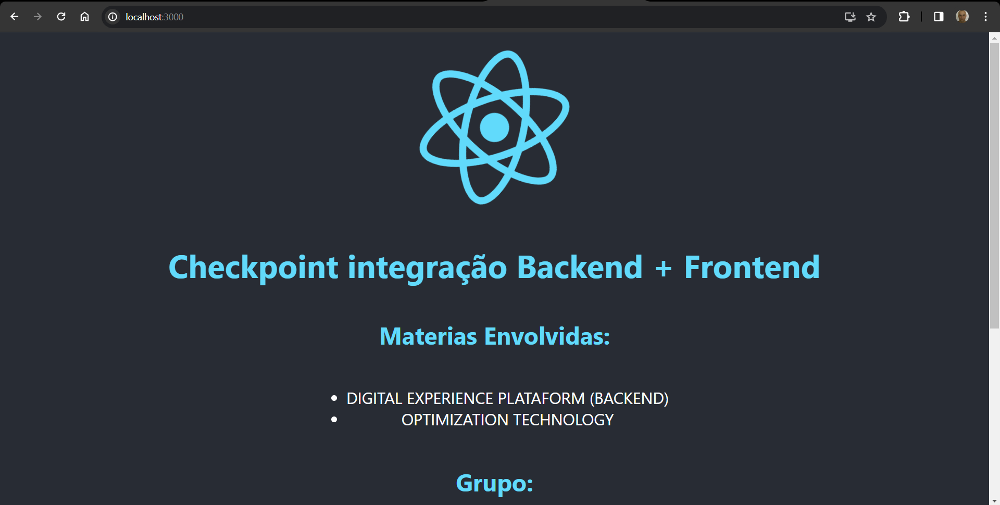

# Conteúdo criado para checkpoint de OPTIMIZATION-TECHNOLOGY(FrontEnd) + DIGITAL EXPERIENCE PLATAFORM(BackEnd)

### Backend

- Desenvolido em Node.js utilizando Express um framework web que facilita a criação de rotas e manipulação de requisições HTTP. 
- No Diretorio Raiz utilizar o comando "npm start" para subir o Backend.

### FrontEnd

- Desenvolido em React para criar o frontend da aplicação, que interage com o backend para exibir informações na interface.

- Abri um novo terminal;
-  No Diretorio Raiz utilizar o comando "cd client" para mudar o diretório;
-  Utilizar o comando "npm start" para subir o Frontend;

-  Após o comando a cima abrir uma página no browser com o conteúdo. Caso não abrir, acessar este endpoint "http://localhost:3000/" no browser.

## Grupo

- André Spinelli Cintra RM 551016
- Augusto de Oliveira Laurino RM 93498
- Caio Felipe Britto Zanardo da Silva RM 95125
- Gabriel Wilke Azevedo RM 95211
- Guilherme de Lucas Garcia RM 94392
